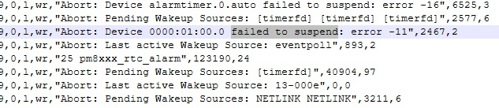
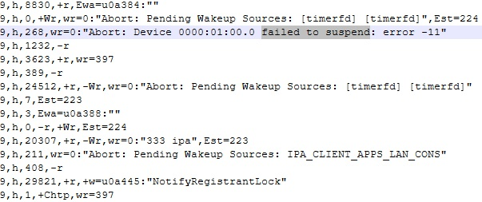
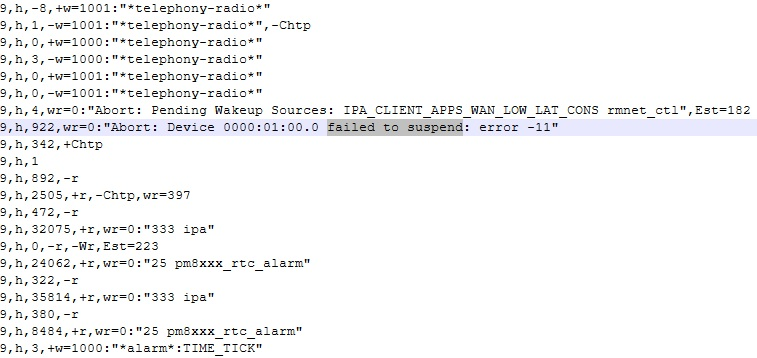
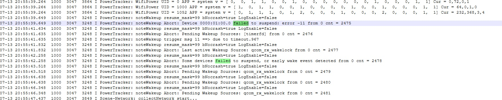
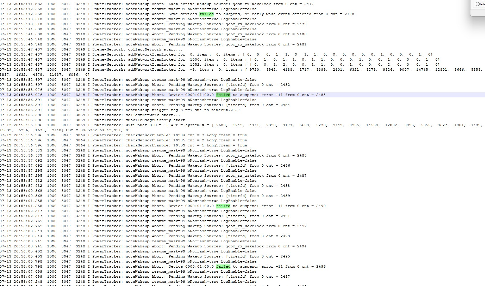
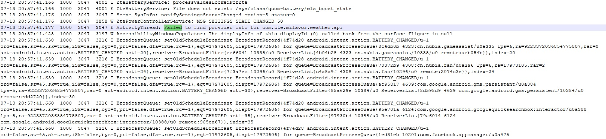
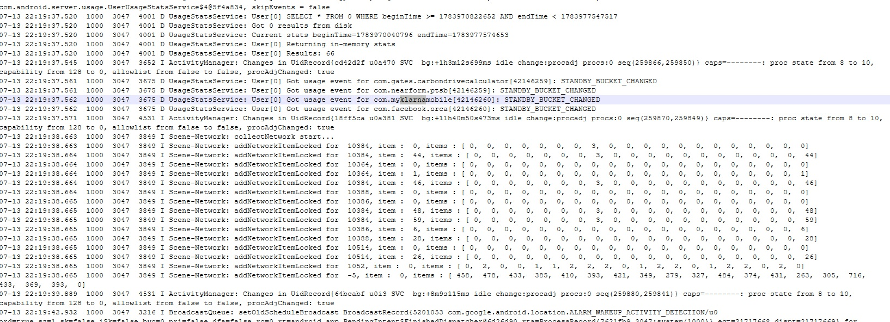
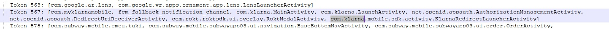
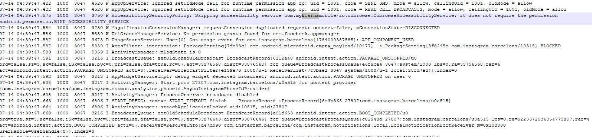
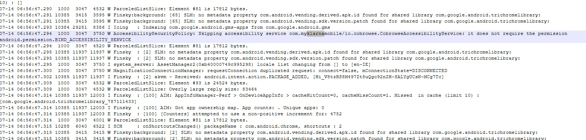

# Forensic Firmware Audit: REDMAGIC 11 Air Systemic Defects & App Failures

This repository serves as a public, verifiable record of system telemetry and kernel-level defects extracted from two independent, factory-spec REDMAGIC 11 Air devices. 

The visual evidence below exposes critical, kernel-level power state deadlocks on the PCIe bus, regional software remnants, security policy mismatches blocking basic Android AppAuth redirection, and unoptimized background tasks. 

These combined firmware errors result in severe standby battery drain, systemic keyboard/UI freezes, and the total operational failure of essential financial and communication applications (e.g., Klarna, Banking Apps).

---

## 🛑 VISUAL EVIDENCE & SYSTEM BUGS

### 1. PCIe Cellular Modem Suspend Loop (Battery Drain)
The physical cellular modem mapped on PCIe lane `0000:01:00.0` routinely refuses to enter a low-power suspend state, returning an `EAGAIN` (error -11) to the kernel power manager. The system's power tracker engine retries this loop continuously at a ~1 Hz heartbeat. The sequential abort counter regularly increments sequentially in seconds, proving the phone cannot enter Android's deep "Doze" sleep state. 

* **Active Wakelock & Alarmtimer Blockers:**
  
  *(See file: log1.jpg)*

* **1 Hz Loop Trapping CPU in High-Power State:**
  
  
  
  
  *(See files: log2.jpg, log3.jpg, log5.jpg, log6.jpg)*

---

### 2. Non-Existent Hardware Query Overload & Copy-Pasted Code
The core battery service continuously loops trying to read `/sys/class/qcom-battery/wls_boost_state` for wireless charging features that do not exist on this physical handset. Simultaneously, the system attempts to query missing Chinese regional weather APIs, causing background thread stalls and resource wastage.

* **Sloppy Ported Firmware Errors:**
  
  *(See file: log7.jpg)*

---

### 3. Draconian Power Throttling of Critical Apps
To desperately claw back battery life lost to the 1 Hz PCIe modem suspend loop, the operating system aggressively demotes critical daily applications—including financial tools like Klarna and PTSB—into heavily restricted background standby buckets. This shuts off background network access and delays secure push notifications (like 2FA bank authorization codes).

* **Standby Bucket Aggressive Restriction:**
  
  *(See file: log8.jpg)*

---

### 4. Security Policy Handshake & AppAuth Blockades
The system's accessibility security manager actively skips Klarna's secure co-browsing and screen layout verification SDK on boot due to a direct permission handshake mismatch. This causes Klarna's security layer to assume a compromised host environment and hang indefinitely on a blank loading screen, completely breaking secure OpenID AppAuth redirection protocols.

* **Accessibility Permission Rejection:**
  
  
  *(See files: log4.jpg, log9.jpg)*

---

### 5. Binder IPC Congestion (System Keyboard Freezes)
Oversized system state lists are passed unoptimized through the system's Inter-Process Communication (Binder) channel, resulting in immediate thread starvation. High-priority UI threads (such as the Android Input Method Editor) are starved, causing the system keyboard and touchscreen inputs to freeze solid for several seconds following system boots.

* **Overly Large Reply Size Congestion:**
  
  *(See file: log10.jpg)*

---

## ⚖️ CONSUMER RIGHTS LAW CLAIM & CONTRACT TERMINATION

The contracts of sale for both defective devices have been formally terminated under the **Irish Consumer Rights Act 2022**. Both REDMAGIC and Klarna have been formally notified. This repository serves as public, immutable, technical verification of a systemic manufacturing defect.
